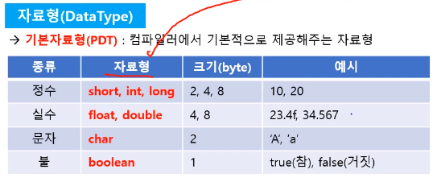
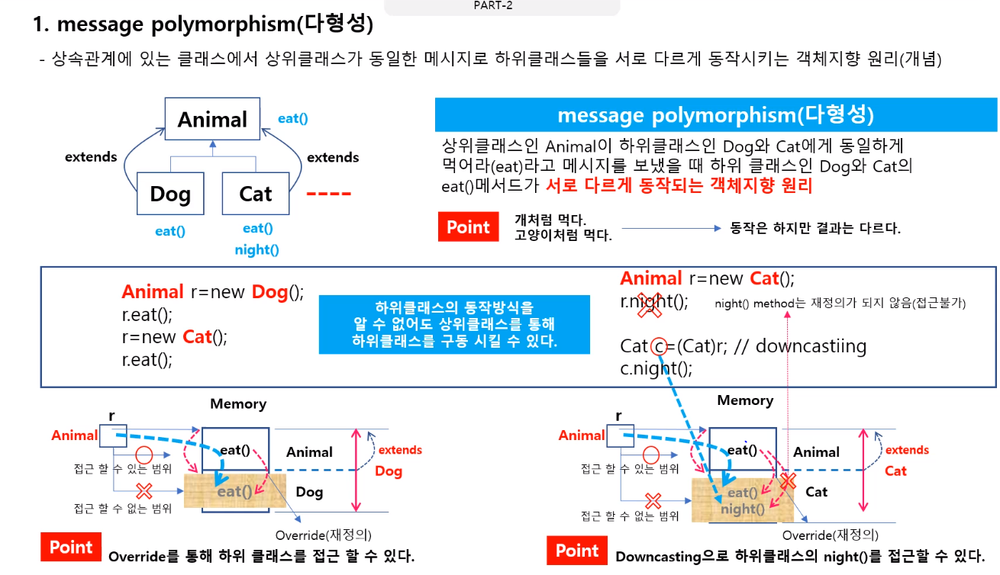
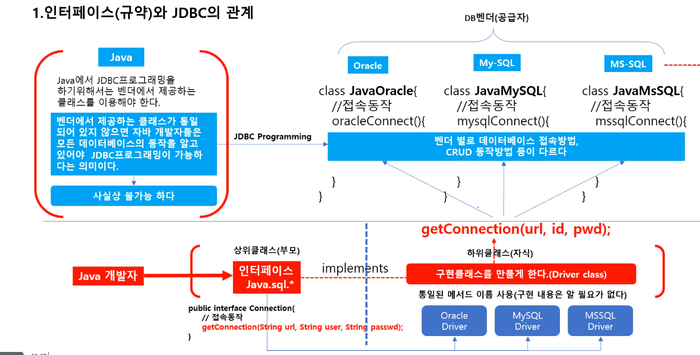
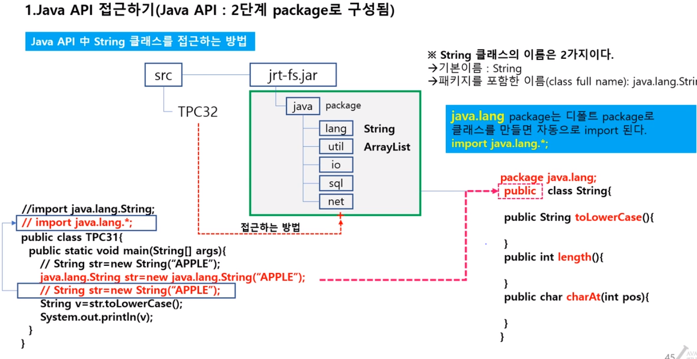

# TPC-part 1

## 자바 구동방식 JVM

1. 123.java 파일 생성

2. class file(1차 컴파일, byte Code화) 바로 실행할 수 없음.

3. 그럼 별도로 이 클래스 파일 실행해주는 엔진이 필요함 -> JVM(java virtual machine)을 통해서 2차 컴파일
   - 구동될 OS 환경에 맞게 ! 재 컴파일 되는 과정.
4. 123.exe 로 바뀜 code와 같이 실행될 수 있도록 바뀜.
   - 실행은 누가함?
     - JVM이라는 프로세스에 통해서 


- 해당 운영체제 맞는 JDK를 설치
  - 메모리 위에 JVM가 탑재 되어있음. 놀고 있지. 
  - 그러다가 실행명령어 123.exe가 오면 메모리에 올려서 실행함.

- 여러 운영체제가 있는 만큼 , 특정 운영체제에 종속되도록 컴파일 하면 안되겠지.
- 그래서 class file을 만들고(<u>공통적으로,byte코드로</u>)
- 실행하라는 명령이 떨어지면, 위 class 파일을 가져가서, JVM이 해당 운영체제에 맞게 2차 컴파일을 함.
- 그러면 다른 언어에 비해서는 **속도가 좀 느리겠네**?

- JAVA를 실행하기 위해서는 **JRE가 필요하다. 개발 환경이 아닌 구동환경**을 위해서


## 변수,자료형 할당

- 변수를 선언한다. 기억공간에 해당 변수에 해당하는 바를 기록한다.
  - 고려해야할 사안은?
    1. 크기
    2. 종류
- `int a,b,c`
  
  1. 크기 **4 byte**
  2. 종류 **int** 형
- int 자료형, a 변수, = 할당 연산자

- 자료형

  - **변수의 크기**와 **변수에 저장될 데이터의 종류**를 결정하는 것

  

  - 컴파일러에서 <u>기본으로 제공</u>해주는 자료형

  

- **사용자 정의 자료형**

  

  - 객체 지향 프로그래밍의 시작점.


- 변수 선언

  - 변수 선언? 메모리에 변수를 만드는 것.

    

- 할당

  - 할당을 해야 변수가 데이터가 저장된다.


## 변수, 배열

- 배열

  - 변수를 연속적으로 만드는 방법
  - **객체 **object로 취급함.. `new` 를 통해 생성해야함. 
  - 동일한 타입의 데이터를 여러개 저장하기 위한 메모리 구조
    - 서로 다른 타입 데이터를 저장하지 못함.

- 2차원 배열

  

  - 메모리에는 연속적으로 배열이 만들어지지만,
  - 우리가 이해하는 방식은 행렬방식으로 이해하는게 편할듯.
  - 3행 4열, 총 12개 3개의 가로, 4개의 세로 
    - 즉 1차원 배열이 여러개 있음.


## 변수, 메서드


- 유사성을 찾아 볼 수 는 있지만, 현재까지 느껴봤을 때는 내가 알던 대로 이해한 대로만 알고있는게 좋을듯.


## Call by Value, Reference


- 메서드의 매개변수 전달기법은 5가지 정도 있음.

- 메서드가 호출이 되려면,

  1. 실인수와 가인수의 갯수가 같아야 하고,
  2. 데이터 타입이 같아야 한다.

  - 즉 매개변수 숫자가 같아야 하고, 그러한 입력된 변수가 설정된 매개변수와 같은 데이터 타입이어야 한다.

- Call by Value
  
  - 값을 전달하는 기법
- Call by Reference 
  - 번지를 전달하는 기법
  - 생성된 메모리 공간을 공유한다.


## JVM Memory Model 2


- JVM이 사용하는 4가지 메모리 영역이 있음. 
  
  - method, stack, heap, literal
  
- stack : FILO

- Main method는 static 키워드가 반드시 있어야, 메모리에 먼저 로딩이 됨.

- PC : program counter , 현재 프로그램이 실행되고 있는 포인터

- **static** keyword

  - 프로그램을 실행전에, method Area 에 로딩을 미리 시키기 위한 키워드

  - 그럼 static 을 안쓸때 어떻게 할까?

    - 어떻게 메모리 위에 올릴까?

    
  
- `TPC80 TPC= new TPC08();`

  - new~ 객체 생성을 통해 heap 메모리 올라갈 장소가 생긴다.
  - 그리고 그 안에 관련된 메서드 기계어 코드가 올라온다.
  - 그런데 메서드는 Method Area 올라오기 때문에
  - add는 Method Area 중 non-static zone에 add 기계어 코드가 올라오고
  - heap Area add 공간은, Method Area - non-static zone - add를 pointer 하고 있는 방식으로 진행된다.

- add는 TPC 객체에서 가르키고 있기 때문에, `TPC.add()` 를 통해 호출한다.

## 기본자료형, 사용자 정의 자료형

- 기본자료형 ? 정수, 실수, 문자.
- 사용자 정의 자료형 ? 

- 새로운 자료형을 만드려면, 

  1. `Class` 로 정의해야함.

  2. 그리고 메모리에 올려야하고(객체를 생성해야하고)

  3. 어떻게? 생성자 메서드를 통해서 

     ```java
     BookDTO = new BookDTO();
     ```

  4. 그래서 클래스를 정의하면, 기본적으로 이러한 객체를 생성하는 <u>생성자 메서드</u> 가 포함되어있음.

  ```java
  public BookDTO(){
      super(); //생략되어있음. 제거해도 자동으로 들어가있으니까.
  }
  //이런식으로 생성자 메서드가 있음. 
  ```

  - default 생성자.
  - 이게 있어야만, <u>메모리에 객체를 생성</u>할 수 있음.

- 객체가 만들어지면, `this` 라는 것이 stack Area에 만들어짐. 이건 자기 자신을 가르키는 객체

- Package ? 폴더 개념


## 객체 생성과정


- VO? Value Object
- Class, 청사진

- 메모리에 객체가 생성되는 동시에, `this` 라는 자기 자신을 가르키는 객체도 생성된다.

- 도트 연산자를 통해, 객체 속성에 **직접적으로 접근하는 방법은 위험한 방법**


## 생성자 메서드


- 생성자 메서드는 **클래스 이름**과  동일함.
- 생성자 메서드는 **return 타입이 없음**.

- 생성자의 역할, 객체를 초기화 한다.
  - 객체를 초기화 하기 전에는, 객체가 생성되어 있어야 한다.

- 오버라이딩(중복정의 **Overloading**)
  - 메서드의 이름이 같지만, 매개변수의 갯수가 다르거나, 매개변수의 타입이 다르거나
  - 자바에서는 이런 함수들을 각각 다르게 판단한다.

- heap memory : new 연산자를 통해 객체가 생성될때 올라가는 메모리

### 

## Private 생성자


- **인스턴스 메서드** : 반드시 new 키워드를 통해 객체 생성후에 접근가능한 메서드
- static 멤버인 경우, new 키워드를 통한 객체 생성이 필요 없음.
  - 그럴 경우, 해당 객체의 생성자 메서드는 private으로 만들어줘서 불필요한 객체생성을 막아주면 좋음

- System. --> static, Math... -->Static 왜? 자주 사용하니까


## class, object, instance


- 정확하게 구분할 필요는 없지만..
- 객체. 객체 타입 + 변수 상태이면 object라 부르고
- 이 object가 구체적인 객체를 가르키면, 이러한 것은 object라 부르지 않고, 인스턴스 변수라 부르게 됨.
- 인스턴스가 만들어져야, 데이터를 넣고 뺄 수 있음.
- 전체적으로 인스턴스를 만드는 과정이라 일컫을 수 있음.


## 잘 설계된 클래스

- 정보 은닉
  - 모든 멤버는 private 변수로 
- 생성자는 명시적으로


- setter, getter
- toString() 메서드 재정의


## 메서드 오버로딩(Overloading)


- 메서드가 이름이 같은게 1000개가 있다면, 속도가 떨어지지 않을까?
  - 그렇지만 예상한 것 처럼 작동하지 않는다.
- <u>컴파일러에서는 각각 이름을 다르게 만들어서 저장한다</u>

- **정적바인딩**. 컴파일 될때, 호출될 메서드가 이미 정해져 있음.


## 동일한 구조, 이질적인 구조


- 배열, 클래스 == <u>객체, 데이터를 담는 바구니</u>
- 배열은 같은 타입으로 담아야 하지만, 클래스는 다른 타입도 가능함.


## Part 1  정리


- 클래스  : 모델링 도구 혹은 많은 정보들을 담는 바구니 (=Model)

- DTO, VO 데이터를 담아놓기 위한 구조 역할

- DAO : Data Access Object Class, CRUD 하는 객체

- DTO, VO, DAO 직접 만들어서 사용하는 Class
- Java 에서 이미 만들어서, 제공해주는 Class도 있음.
  
  - API, String, System, Integer, ArrayList...
- 다른 회사에서 제공하는 API도 있음.

- 클래스라하면, 상태정보, 메서드도 있음.
  
- String 은 Class. 그럼 상태정보, method도 있겠네?
  
- 빈번하게 사용하는 클래스의 `import` 는 생략되어있음.

  ```java
  java.lang.String str = new java.lang.String("Apple"); //이렇게 안해도됨
  ```

  

---


# TPC-part 2

## 수평적구조, 수직적구조


- 동작하는 측면에서 클래스를 설계

- 상속 : 부모가 자식에게 무언가를 남김.
- 왜 상속을 할까? **코드의 중복을 없애기 위해**

- `extends` , 확장하다. 상속받은 객체 입장에서 표현하는 말.
  - 즉 위의 예로부터 살펴보면, Animal이라는 객체는 Object라는 객체로 부터 확장되었다. 
  - 무언가 상속을 받고, 좀 더 추가된 것도 있음을 내포하는 말인듯.

- 모든 클래스의 최상위 클래스 root class == **Object Class**
- 모든 객체는 부모 클래스가 있어야함. 
- <u>Object -> Animal -> Dog, Cat</u> 이런식으로 객체가 만들어짐.
  - 상속 체이닝

- 상속은 소유의 관계가 아님. 부모가 물려줬다고 온전히 자식것이 되는 것이 아니다.

## 오버라이드(Override)


- **재정의**

- 상속받은 부모의 속성을 자신의 입맛대로 바꿔서 사용하는 방법

- 받는 타입이 Animal이면, 메모리에서 접근할 수 있는 바가 한정되어있지 않나?
  - 그럼에도 불구하고, Dog 클래스가 eat()를 재정의 해뒀다면, 
  - Animal eat()를 실행해도 하위클래스를 eat()가 실행하도록 되어있음.
  - <u>이 말은, Dog method를 몰라도, Animal 객체 생성을 통해 접근 할 수 있다.</u>

- 정적 바인딩 == Overloading 컴파일 시점에서 어느 메서드가 호출될지 결정하는 바인딩
- 동적 바인딩 == Override, 실행시점에 어느 메서드가 호출될지 결정되는 바인딩
  - 단 Override는 프로그램의 속도가 떨어지는 원인이 됨.

- 자동 형변환, 작은 타입이 큰 타입으로 들어가는 것은 **자동** 


### 

- Java - Object 최상위 객체

- 재정의를 하면 부모타입으로 객체를 생성해도, 자식 타입의 메서드에 접근할 수 있음.
- **실행시점**에서 재정의된 메서드를 찾아감 (동적 바인딩)
- 업캐스팅으로 객체를 생성했을 때 장점
  - 자식타입에 어떤것이 있는 지 몰라도 접근할 수 있음.

- `super()` 
  - <u>자식이 부모에 있는 생성자를 호출하는 메서드</u>

- 상위 클래스가 하위 클래스들에게 동일한 요청을 보낼 때, 다르게 반응하는 것 : **다형성**


## 형변환


- 기본 자료형도 casting을 할 수 있음.
- 또한, 객체들끼리도 casting(형변환) 을 할 수 있고.

- `(Cat)ani.night(); ` 
  - . 연산자가 우선 그다음 casting
  - `((Cat)ani).night();` 이렇게 해야 작동할 듯.


## 다형성



- 부모 클래스의 역할은 일종의 리모콘 역할. 

- 다형성, 객체지향의 꽃


- 활용


- 다형성 보장 전체조건

  - 클래스 간 상속관계

  - 객체 생성에 있어 upcasting하게

    ```java
    // B extends A
    A a = new B();
    ```

  - 하위 클래스가 **반드시** Override(재정의) 해야함.

- 다형성 배열.
  - 서로 다른 배열을 담을 수 있다.
  - 즉 Animal Type 배열이라면 그 하위 클래스인 Dog, Cat을 모두 Animal 배열에 담을 수 있다.

```java
if(ani[i] instanceof Cat) {
    ..// ani[i] 가 Cat으로 부터 생성된 인스턴스 라면
}
```


## 추상클래스


- 다형성이 보장되어야 함. 어떻게? Override가 되어있어야함. 즉 부모에서 있는 특징은 자식이 재정의해야함.
- 그렇지만 **추상클래스**를  사용하면 다형성이 **일부** 보장된다.

- 추상클래스(<u>abstract</u>) 는 구현부가 없다.

  ````java
  public abstract class Animal {
      public abstract void eat();
  }
  ````

- abstract 클래스는 불완전한 클래스. 추상 클래스는 객체를 생성할 수 없음.

  - 그러므로 반드시 자식하고 연결되어야 제 역할을 할 수 있다.

- 추상 클래스는 <u>서로 기능이 비슷한 클래스</u>를 묶을 때 사용한다
- `extends`


## 인터페이스


- 100% 보장? 상위클래스에서 정의한 메서드는 반드시 하위 클래스에서 구현해야한다.
- 인터페이스는 서로 기능이 다른 클래스를 묶을 때 사용
  - TV, Radio 클래스는 서로 다른 기능을 가지고 있을 것

- 인터페이스는 아무 기능이 없음.
  - 인터페이스가 가지고 있는 불완전한 키워드를 구현하는 것 `implements` 

- 인터페이스가 부모다? 모든 자식들이 인터페이스에게 통제 당할 것
  - 즉 부모가 명령을 내렸을 때, 자식이 무조건 반응할것.
  - 이 말은 <u>다형성을 100% 보장</u>한다는 말과 동일하다


```java
public interface RemoCon{
    //추상 메서드
    public void chUp(); //abstract 가 숨겨져 있음 == public abstract void chUp(); 과 동일함
    public void chDown(); 
    public void internet();
    
    //상수
    int MAXCH = 100; // public static final int MAXCH = 100; 과 같음
    int MINCH = 1;
}

public class TV implements RemoCon{
    @Override
    public void chUp(){
        System.out.println("TV 채널 업")
    }
    .....//나머지 chDown, internet도 구현됨
}

public class Radio implements RemoCon{
    @Override
    public void chUp(){
        System.out.println("Radio 채널 업")
    }
     .....//나머지 chDown, internet도 구현됨
}
```

- 인터페이스는 객체 생성 못함.
- 추상클래스, 인터페이스 공통점
  
- 다형성을 보장하기 위한 방법
  
- 인터페이스에서는 **상수를** 둘수 있음

  `int MAXCH = 100;`  이건 `RemoCon.MAXCH`로 접근할 수 있음


## 추상클래스, 인터페이스


- 공통점
  - 객체로 생성 못함.
  - 하위 클래스로 인해 만들어져야함
  - 부모의 역할을 함

- 추상클래스
  - 서로 기능이 비슷한 클래스의 공통 부분을 묶을 때 사용
  - 구현, 추상 메서드를 **함께** 가질 수 있음.
  - 구현 메서드를 가질 수 있음.
  - 단일 상속
- 인터페이스
  - 서로 기능이 다른 클래스의 공통 부분을 묶을 때 사용
  - 100% **추상 메서드** 로만 이루어짐.
  - final static 멤버 변수 == 상수를 가질 수 있음.
  - <u>다중 상속 지원</u>
    - cf 자바는 기본 단일 상속 지원


## 인터페이스, JDBC 관계



- 인터페이스 : 룰
- Java.sql * 인터페이스 --> 밴더사들이 가져가서, 구현 클래스를 만듬. 이러한 클래스를 Drvier 클래스라 말함

- 접속 구현까지는 모르지만 --- 핵심
- 우리는 인터페이스를 알고 있으니까. 어디 Driver든 사용할 수 있도록 해준다 == 매직!


## 인터페이스 상속 관계


- X 입장에서는 A,B 모두 부모다.
- 그러므로 타입을 A,B모두 만들 수 있음
- `Public class Dog extends Animal implements Pet, Robots`
  - Animal을 상속받고, Pet과 Robots 모양을 구현했다고 말할 수 있다.
  - 추상 클래스는 하나만 상속 받고,
  - 인터페이스는 여러개 구현 할 수 있음.


## Object 클래스


- 최초의 부모
  1. `toString` 메서드 존재. 객체가 만들어지면 본질을 문자열로 출력해줌.
     - 재정의 하지 않았으면 객체의 주소가 출력되고
     - 재정의 하면, 재정의된 메서드가 출력됨.

- 기본적으로 모든 자바 파일에는 `import java.lang.*;` 가 생략되어있음.

  - 기본적인 클래스 파일에는` extends Obejct` 도 생략되어있음.

  - 그리고 

    ```java
    public A() {
        super(); //생성자도 생략되어있고
    }
    ```

    


- Object로 받을 때는 괜찮.
  - 다만 사용할때는 다운 캐스팅을 통해 사용해야함.


## 객체지향 학습정리


- 정보은닉 : 객체가 가지고 있는 정보에 마음대로 접근하는 것을 막는 것
  - private 사용
- 상속 : 클래스를 수직적구조로 설계하는 것
  - 부모 클래스를 이용하면 자식 클래스에 언제든지 접근 가능
  - 상속은 다형성 기법을 사용하기 위해 필연적으로 필요
- 다형성 
  - 동적바인딩. 실행 시점에서 어떤 메서드가 실행될것인지 결정되는 방식. 프로그램 속도는 떨어지짐.
- 추상클래스, 인터페이스
  - 객체 생성 못함
  - 부모의 역할은 할 수 있음. 
    - 즉 다형성 보장을 위한 방법임. 


## 패키지


- 패키지 : 폴더 개념
- 기능이 비슷한 클래스를 모아가지고, 관리를 쉽게하기 위해서 패키지를 씀.

- 클래스들 끼리 이름이 같을 수 있음. 어떻게 해야할까? 
  - <u>구분자를 하나 더 둔다. == 패키지</u>

- 어떤 클래스에 접근하기 위해서는, **클래스 풀 네임**(패캐지를 포함한 이름)을  알아야함
  - 접근 권한을 Public으로 해야함,

- 빨간색 박스 == default 접근 제어자가 생략되어있음
  - 패키지 밖에서는 접근할 수 없음.
  - 클래스 안에 있는 클래스들 끼리는 접근 가능


## JAVA API



- API ? 여러개의 클래스를 모아둔것
  - JAVA API는 jar파일로 묶어서 배포된다.

- 자주 사용되는 패키지는 `import` 이미 되어있다.
  - `java.lang.*` ...

- Qualified Name == Package name까지 포함해서..


## String 객체


- String은 기본자료형이 아니라, 별도의 클래스로 만들어놓은 사용자 정의 자료형이다.

- String은 클래스
  - new 클래스로 만들면 **heap 메모리**, 객체가 생성되는 메모리 영역에 생성

- `" "` 묶어있으면 객체로 생성. 어디에? 
  - **Literal Poo**l에 생성. 이 영역의 특징은 재 사용이 가능하다.


## API


- 배열은 연속적으로 메모리 구조가 만들어진다.
- 배열처럼 동작하는 클래스(API)를 만든다.
- 모든 API 를 다 숙지할 수는 없다.
  - 우리에게 필요한 기능을 가진 API를 만들어서 이용하면 편할 것.

- `ArrayList`
  - API


## ArrayList


- **API**
- Object 배열
  - 왜? 모든 타입의 객체를 저장할 수 있도록

- 길이의 제한이 없음.
  - 왜? 설정된 길이 이상이되면, 자동으로 용량이 늘어나도록 설정됨.
  - 즉 사용자가 신경쓸 필요없음.

- `Instanceof` : 객체끼리 비교할때
- Object가 나오면 업캐스팅, 다운캐스팅 유의하자.
- `Generic.. < >`

- `ArrayList` from java.util.*....


- 실습


- <u>사이즈 설정해놓지 않으면 기본 10</u> 
- 설정된 길이를 넘을 때 마다, 자동적으로 늘어나는 만큼 길이의 제약이 없다는 점이 큰 장점이다.


## Wrapper 클래스


- **포장** 클래스
  - 즉 뭔가를 감싼다.
  - 기본 자료형을 **객체 자료형으로** 사용할 수 있도록 감싼다

- Object(부모) Integer(int 자료형, 자식)

- 포장을 어떻게 제거할까?

  ```java
  Integer a = new Integer(1); // wrapper class
  
  int b = a.intValue(); // 포장을 제거
  int c = a.toString();
  int c = a.parseInt(); 
  ```

  

- 박싱, 언박싱 boxing, unboxing

  - wrapper클래스 변환을 컴파일러가 자동으로 해주는 것.
  - Boxing

  ```java
  Integer b = 1;
  
  Obejct[] obj = new Object[3];
  obj[0] = 1;
  obj[1] = 2;
  obj[2] = 3;
  ```

  - Unboxing

  ```java
  int b = new Integer(10);
  ```

  - 왜 이게 가능하지?
    - <u>컴파일러가 자동으로 해준다</u>.

- `.parseInt()`  == static method